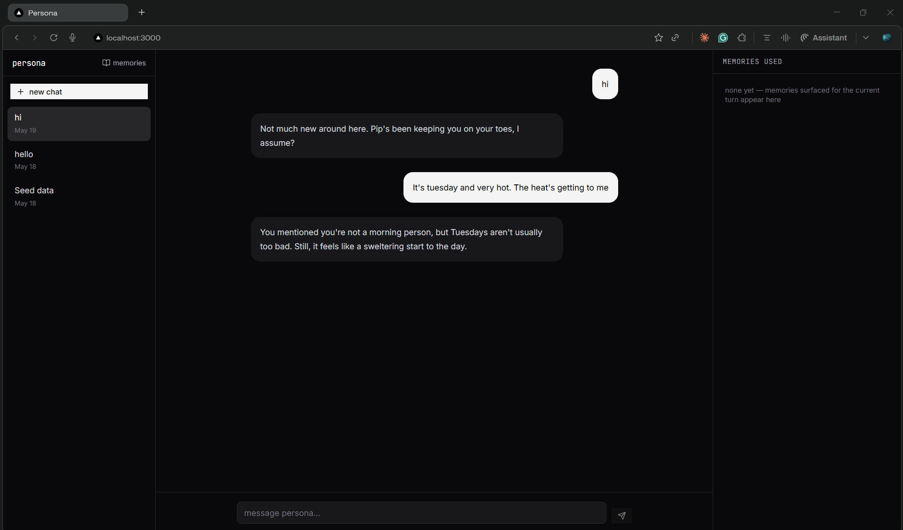
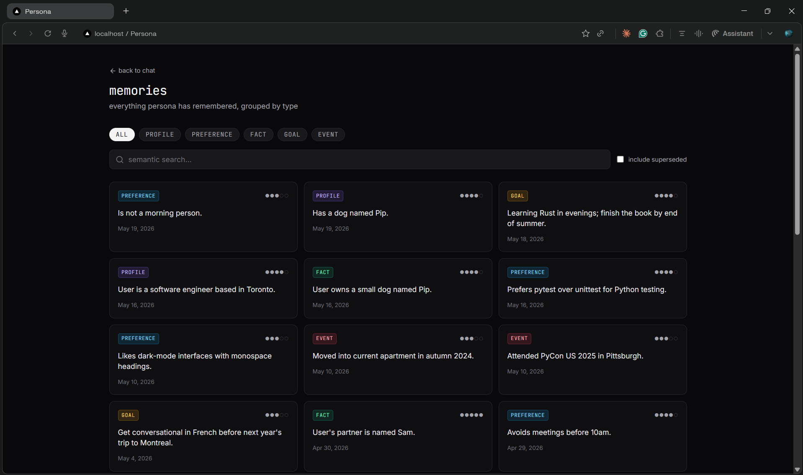
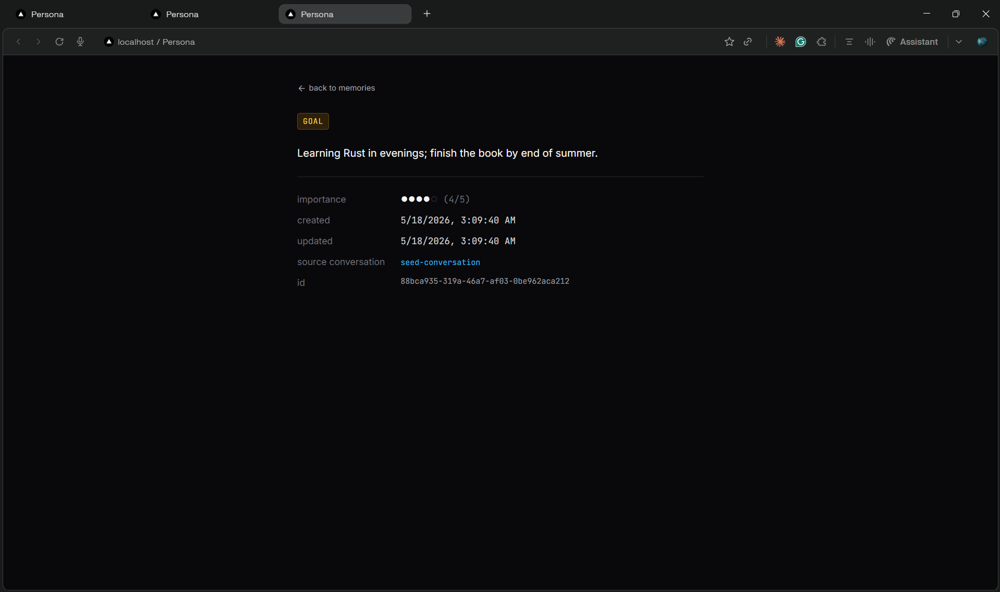

# Persona

A conversational AI companion with a typed, persistent SQLite-backed memory. Backend is FastAPI + LangGraph; frontend is Next.js 14. Runs locally against the Hugging Face Inference API for chat and a local sentence-transformers model for embeddings.

See [design.md](./design.md) for architecture and [plan.md](./plan.md) for the implementation plan.

## Screenshots

Chat with memory rail:



Memory inspector:



Memory detail:



## Quickstart

1. **Create a Hugging Face token** at [huggingface.co/settings/tokens](https://huggingface.co/settings/tokens). A `read` scope is enough.
2. **Accept the Llama-3.1 license** — visit [huggingface.co/meta-llama/Llama-3.1-8B-Instruct](https://huggingface.co/meta-llama/Llama-3.1-8B-Instruct) and click **"Agree and access repository"** (one-time, per HF account).
3. **Configure env:**

   ```bash
   cp .env.example .env
   # paste your token into HF_TOKEN
   ```

4. **Install deps** (warning: pulls torch — ~1GB; first chat / seed downloads the embedder model ~400MB, cached to `~/.cache/huggingface/`):

   ```bash
   make install
   ```

5. **Seed sample data and run:**

   ```bash
   make seed
   make dev
   ```

6. Open [localhost:3000](http://localhost:3000).

### Windows

`make` isn't built-in on Windows. Either install GNU Make (`scoop install make`) or run the commands in two terminals:

```cmd
:: terminal 1 — backend
cd backend
.venv\Scripts\python.exe -m uvicorn persona.main:app --reload --port 8000

:: terminal 2 — frontend
cd frontend
npm run dev
```

Seed:

```cmd
backend\.venv\Scripts\python.exe scripts\seed.py
```

Reset DB:

```cmd
del /q data\persona.db data\persona.db-shm data\persona.db-wal 2>nul
```

## Directory map

| Path | Purpose |
| --- | --- |
| `backend/persona/` | FastAPI app, LangGraph chat graph, memory store, HF client. |
| `backend/persona/db/` | SQLite connection, migrations, `sqlite-vec` schema. |
| `backend/persona/memory/` | `Memory` Pydantic schema, CRUD store, retrieval ranking, dedup, extraction. |
| `backend/persona/agent/` | `ChatState`, graph nodes (`retrieve → respond → extract → persist`), prompts. |
| `backend/persona/api/` | REST routes: `/health`, `/conversations`, `/chat` (SSE), `/memories`, `/stats`. |
| `backend/tests/` | Pytest unit + integration tests. |
| `frontend/app/` | Next.js App Router pages: chat, memory inspector, memory detail. |
| `frontend/components/` | `Chat/*` and `Memories/*` React components. |
| `frontend/lib/` | Typed REST client, SSE chat helper, shared types. |
| `scripts/seed.py` | Inserts ~30 sample memories across all 5 types. |
| `data/` | SQLite DB lives here (gitignored). |

## 60-second demo

```bash
make reset   # clean DB
make seed    # ~30 memories, all 5 types
make dev
```

1. Open [localhost:3000](http://localhost:3000), click **+ new chat**.
2. Ask: *"What should I work on tonight?"* — the response should reference seeded goals/preferences (e.g. side project, Rust book).
3. Watch the right rail: **memories used** lists what the retriever pulled, color-coded by type.
4. Visit [/memories](http://localhost:3000/memories), click the **goal** chip — only goals show.
5. Click a memory card — detail page shows importance, source conversation, timestamps.

## Troubleshooting

| Symptom | Cause / fix |
| --- | --- |
| `403` from Hugging Face Inference API | You haven't accepted the Llama-3.1 license. Visit the model page and click "Agree and access repository". |
| `429` / rate limit errors | Free HF Inference API tier is bursty. Wait a minute, or upgrade to dedicated Inference Endpoints. The extraction node already swallows these so chat continues; chat-path 429s surface in the UI. |
| First request hangs 10–30s | Cold start — either the local embedder is loading or the HF endpoint is warming. Subsequent requests are fast. |
| `sqlite-vec` load fails on fresh Windows install | Ensure the wheel installed (`pip show sqlite-vec`). Try `pip install --force-reinstall sqlite-vec`. |
| Llama wraps JSON in ` ```json ` fences | Expected; the extractor strips fences and retries once. Drop-invalid validation absorbs any leftover noise. |

## Tests

```bash
make test
```

Real-HF smoke test (env-flagged, hits the live API):

```bash
RUN_HF_SMOKE=1 HF_TOKEN=hf_... pytest -v backend/tests/test_smoke_real_hf.py
```
